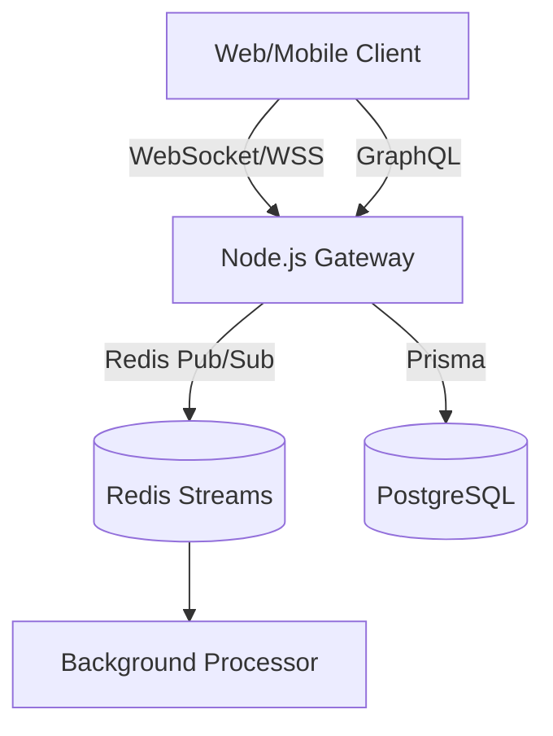

# TS-WebSocket-Chat


A production-ready real-time messaging gateway built with Socket.io, Express, and strict Zod runtime schema validation.

## System Architecture





## Elite Features
- **Real-Time Pub/Sub**: Room-based broadcasting ready for Redis adapter scaling.
- **Runtime Validation**: Strict Zod schemas for all incoming WebSocket payloads.
- **Hybrid Architecture**: Co-located REST API and WebSocket server.

## Quick Start
```bash
docker-compose up -d redis
npm ci
npm test
npm run build && npm start
```
